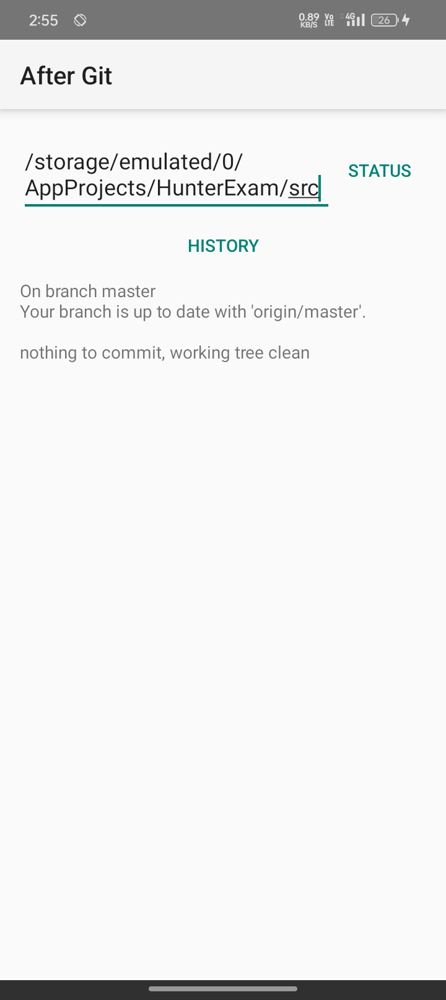
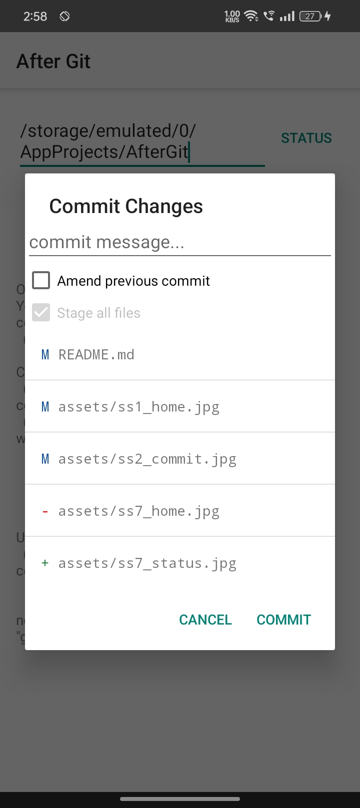
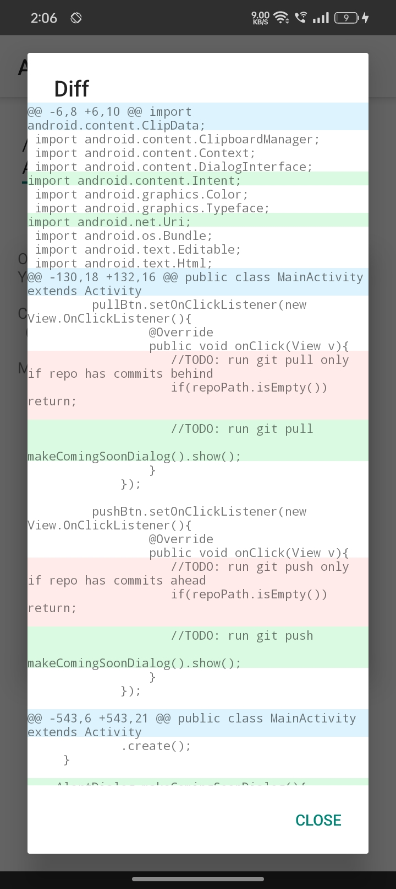
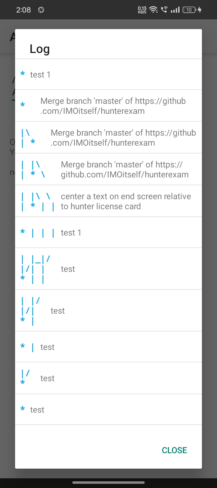
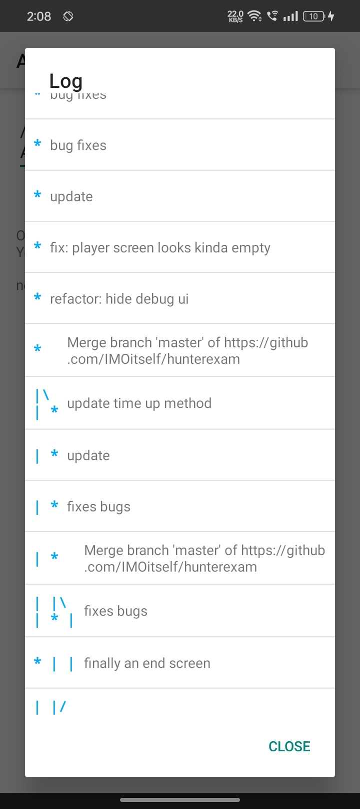
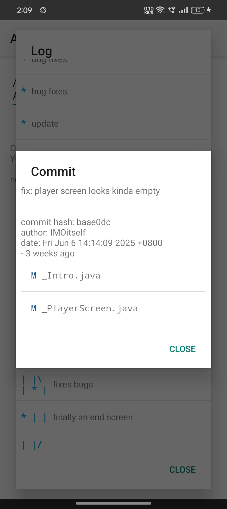
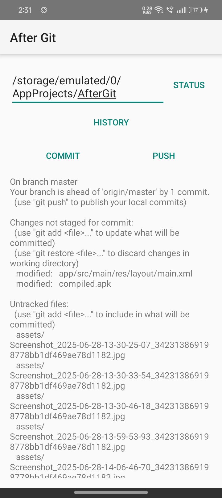
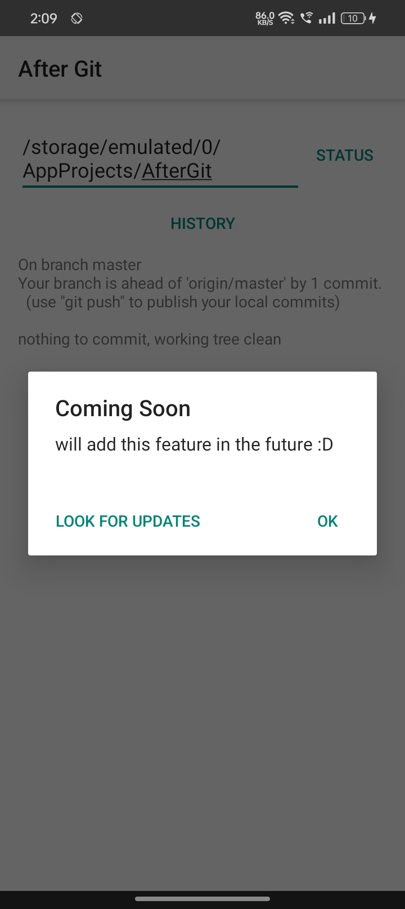

# AfterGit-Official

**simplest git client that uses Termux's API**

> [!NOTE]
> this is the Gradle version of [AfterGit](/storage/emulated/0/AppProjects/AfterGit) which is an AIDE project.

## Download

[](https://github.com/IMOitself/AfterGit/releases/)

<br>

## Installation
> [!IMPORTANT]
> must have [Termux](https://f-droid.org/en/packages/com.termux/)   installed <br><br>
>  must have run this command on Termux first:
> ```bash
> pkg install termux-api
> sed -i 's/# allow-external-apps = true/allow-external-apps = true/g' ~/.termux/termux.properties
> termux-setup-storage
> ```
<br>

## Features

- [x] check repo status
- [x] list unsaved changes
- [x] commit changes
- [x] commit amend
- [x] show unsaved changes' diff
- [x] commit history
- [x] commit history graph
- [x] commit diff
- [ ] push
- [ ] fetch
- [ ] pull

<br>

## Screenshots

> [!TIP]
> idk i just like the green alert thingy here :D









